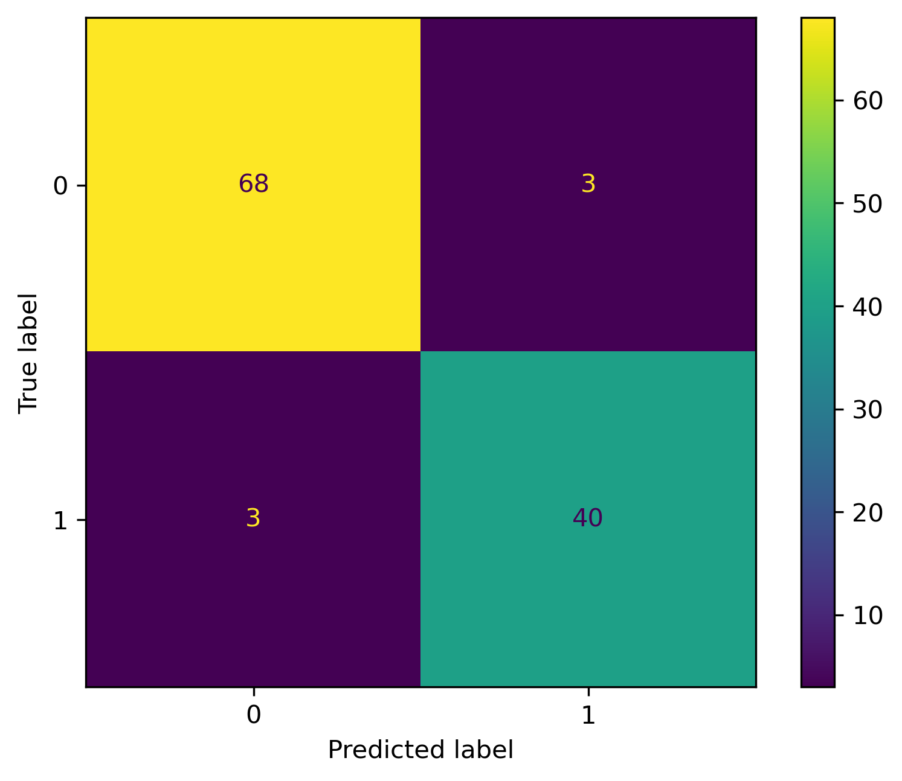
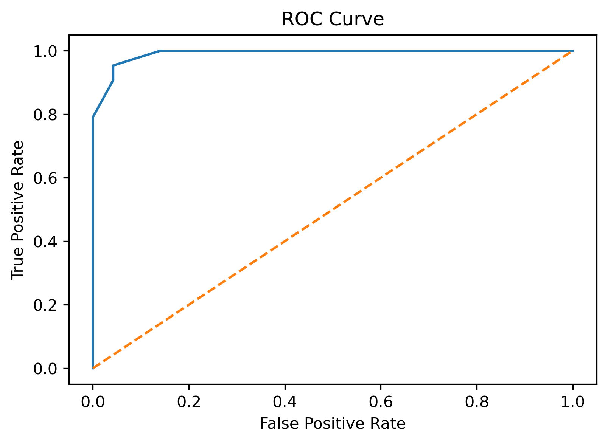

# Breast Cancer Prediction

## Project Overview

This project uses machine learning algorithms to predict whether a breast tumor is Benign or Malignant based on diagnostic features from the Breast Cancer Wisconsin Dataset.

## Features

- Data preprocessing
- Exploratory Data Analysis (EDA)
- Feature selection
- Model training and evaluation
- Accuracy comparison of multiple algorithms
- Prediction on new data

## Technologies Used

- Python
- NumPy
- Pandas
- Matplotlib
- Scikit-learn
- Jupyter Notebook

## Machine Learning Models

- Logistic Regression
- K-Nearest Neighbors (KNN)
- Gaussian Naive Bayes

## Dataset

Breast Cancer Wisconsin Dataset

## Results

- Logistic Regression achieved the highest accuracy of approximately **97%**.

### Confusion Matrix

### ROC Curve

## Future Improvements

- Deploy the model as a web application using Flask or Streamlit.
- Improve performance using hyperparameter tuning.

## Author

**Aaniya**

